# Cuttle CANServo_Driver — SWD pogo programming jig

A 3D-printed spring-nest fixture for flashing the Cuttle CAN servo driver
board over SWD, using P50-B1 pogo probes against the seven bare-copper test
points on the underside of the board. No PCB required — five printed parts,
four springs, seven probes and a GH-201 toggle clamp.

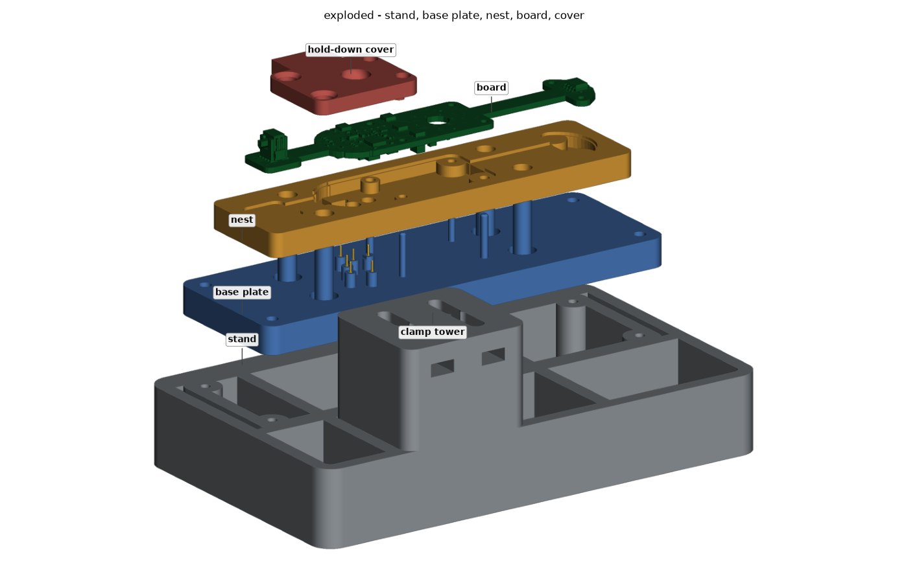

## How it works

The board never has to be pushed onto exposed probe tips by hand:

1. A **nest** floats 3 mm above the base on four springs. The probe tips sit
   **1.8 mm below** the board when the clamp is open, so the board drops in
   freely and locates on two pins through its own 2.2 mm holes.
2. Closing the clamp pushes a **hold-down cover** down onto five pads that
   land on bare board, driving the nest onto a hard stop.
3. At the stop the nest has travelled exactly 3 mm, which compresses each
   probe **1.20 mm** — 45 % of the P50's 2.65 mm stroke.

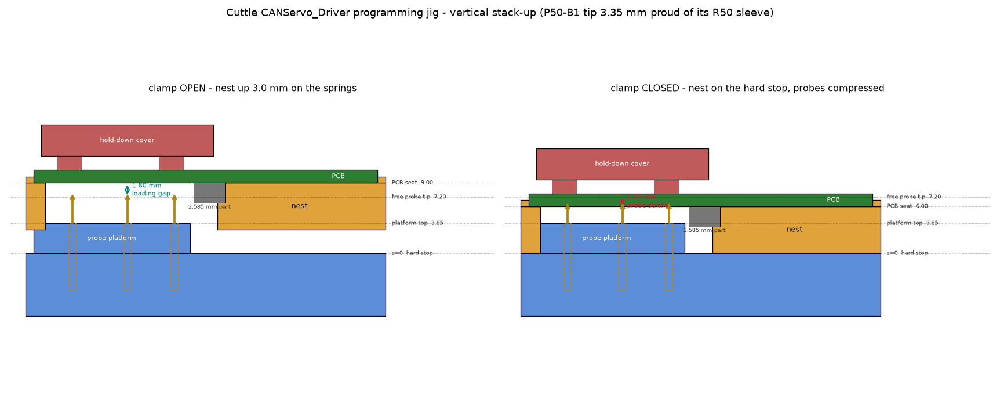

## The board

Everything below was extracted from the V0.4 gerbers and the KiCad STEP
export, not typed in by hand — see [`cad/tools/`](cad/tools). The board is a
6-layer rigid-flex, 104.6 × 20.1 mm, 1.627 mm thick, in three rigid sections
joined by two 6 mm flex necks. The jig supports all three flat so the flex is
never bent during programming.

The seven test points are **bare copper discs with solder-mask openings**, not
pad footprints — Ø1.2 mm, all on the bottom layer (L6):

| Net | X | Y | note |
|---|---:|---:|---|
| NRST | −32.25 | +1.70 | 1.42 mm from the board edge |
| GND | −28.25 | −6.30 | |
| SWO | −26.25 | −1.70 | |
| VDD_3V3 | −23.45 | +5.40 | |
| VDD_3V3 | −23.15 | −8.80 | 1.12 mm from the board edge |
| SWDIO | −22.25 | +1.30 | |
| SWCLK | −17.15 | +1.90 | |

Coordinates are in the jig frame: origin at the centroid of the four Ø2.2 mm
holes on the main rigid section, +Y up. Those four holes are the motor /
connector pattern, not board-mounting holes; the jig borrows two of them
(diagonal, 29.6 mm apart) purely to locate the board.

The nest does not try to thread a support surface between the components.
It seats the board on six bosses at its own mounting holes plus the three
sections that carry **no bottom-side parts at all** — the SWD tab and both flex
necks — and drops everything else in one pocket. A boss under the MCU stops
0.1 mm short of the package, backing the board against probe force without
lifting it off its seat. Nothing on the part is thinner than 3 mm.

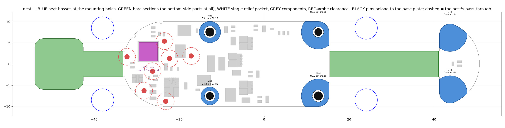

## Views

| | |
|---|---|
| 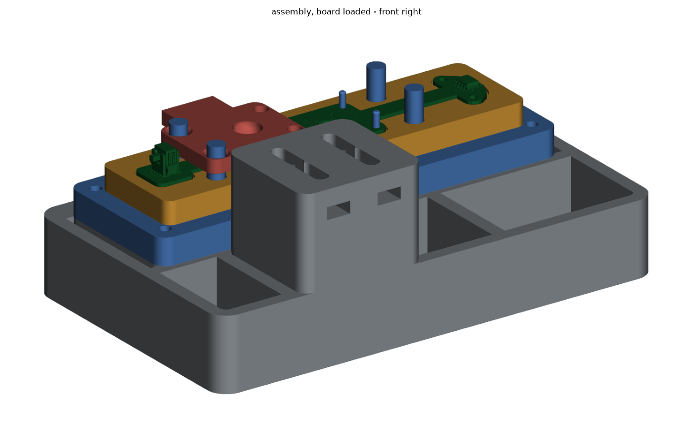 | 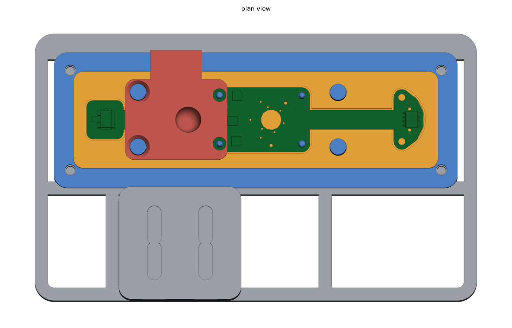 |
| 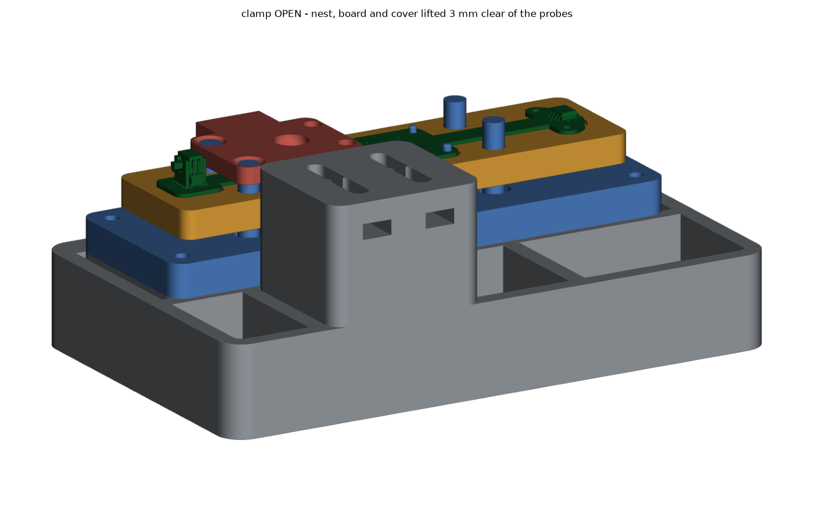 | 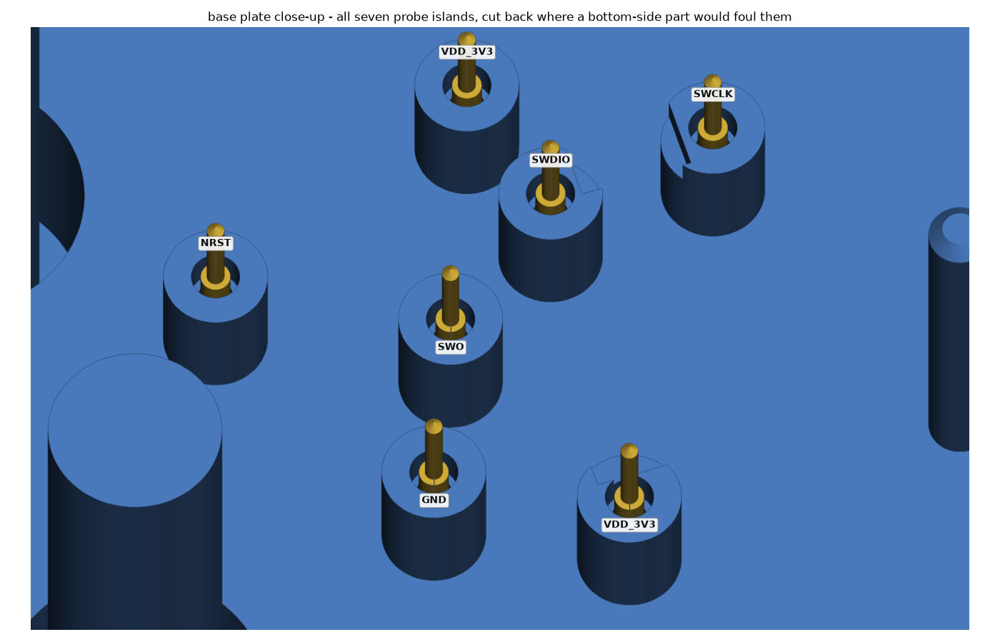 |
| 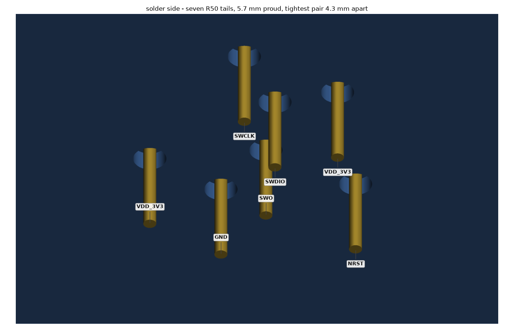 | 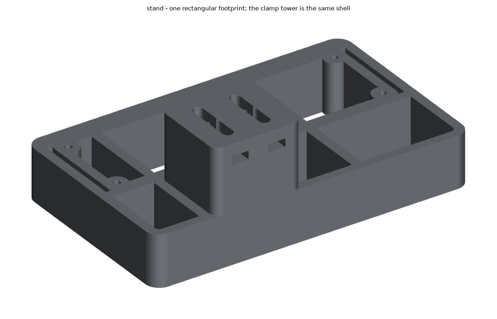 |
| 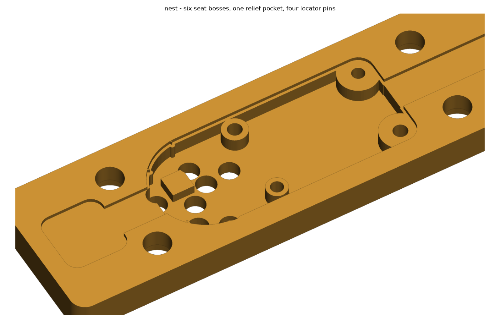 | 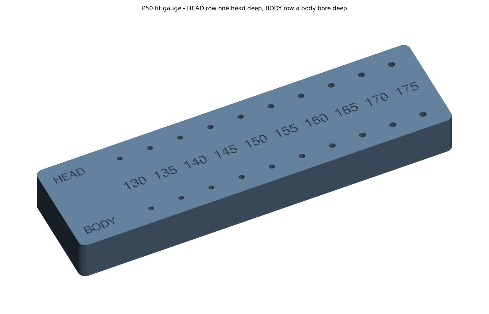 |

`python3 tools/render.py` regenerates all fifteen; `python3 tools/render.py top
probes` does just those. The renderer is a small software z-buffer rasteriser
(orthographic, backface-culled, 2x supersampled, with a depth-discontinuity
outline pass) — a painter's-algorithm sort mis-orders the stand's large flat
faces against the base plate.

## Parts

| Part | Print | Notes |
|---|---|---|
| `base_plate` | flat, posts up | The precision part: 7 probe bores, 4 guide posts, 4 board locator pins, spring pockets |
| `nest` | flat | Six seat bosses, one relief pocket, pass-throughs for the locator pins |
| `cover` | pads up | Hold-down; presses only on bare board |
| `stand` | as modelled | One piece, one rectangular footprint: board bay, clamp tower, 22 mm of wiring space |
| `fit_gauge` | flat | Calibration coupon; print once to set the probe bore size |

STEP and STL for all of them are in [`cad/out/`](cad/out).

## Getting started

Build instructions, bill of materials, the bore calibration step and the wiring table
are in **[docs/BUILD.md](docs/BUILD.md)**.

To regenerate everything after changing a dimension:

```bash
cd cad
python3 jig.py        # writes STEP + STL into cad/out/
python3 verify.py     # 40 interference and stack-up checks
```

`verify.py` checks the parts against a keep-out solid built from the real
component heights. That solid uses each component's bounding box, so it is
strictly larger than the parts themselves — a clean result is a proof of
clearance, not a sample of it. `extract_parts.py` refuses to emit a model that
would leave any board-spanning solid unaccounted for, which is what makes the
conservative claim hold. `python3 verify.py --full` re-runs the same checks
against all 1037 solids of the STEP export if you want the exact numbers;
it takes far longer and cannot find anything the fast path misses.

## Board source files

`cad/ref/` holds the inputs the extractors read — the V0.4 gerbers and the
KiCad STEP export — and is **git-ignored on purpose**: this repository is
public and the servo board repository is not. Copy them in locally before
re-running the extractors. The derived `board_geometry.json` and
`board_parts.json` that `jig.py` actually builds from are committed.

## Retargeting to a new board revision

```bash
cd cad/tools
python3 extract_board.py   # outline, cutouts, test points  <- gerbers
python3 extract_parts.py   # component keep-outs            <- STEP
cd .. && python3 jig.py && python3 verify.py
```

Nothing in `jig.py` hard-codes board geometry; it all comes from
`board_geometry.json` and `board_parts.json`.
